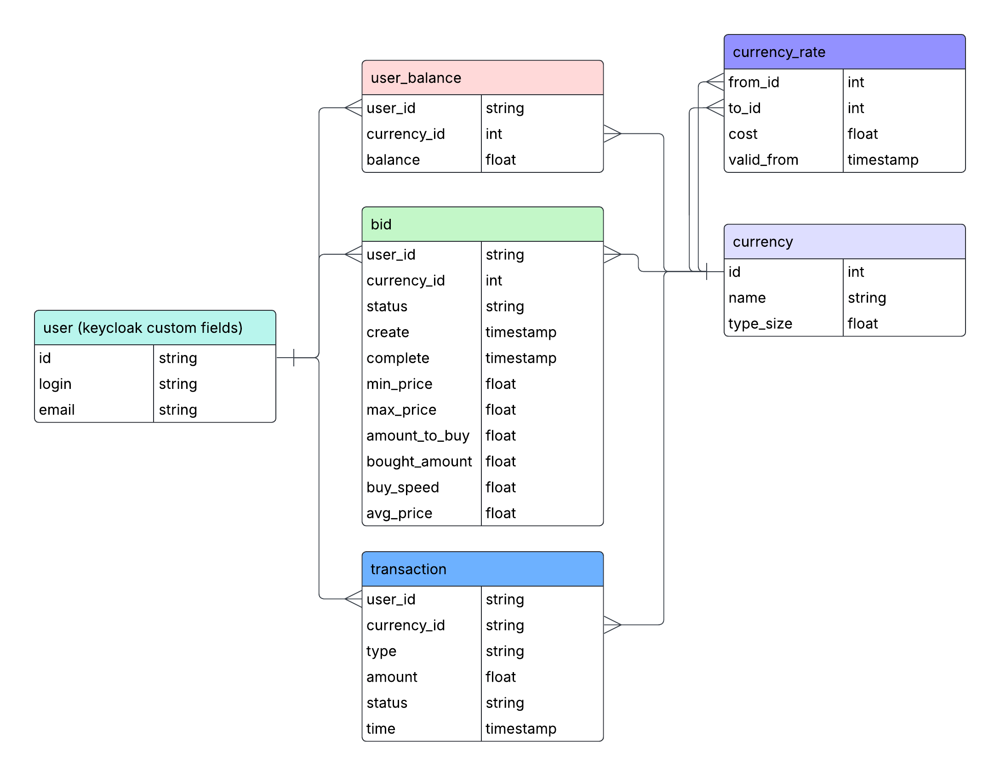

# Continious crypto market | HSSE MIPT Project

### Design idea: https://papers.ssrn.com/sol3/papers.cfm?abstract_id=2924640

### Parts:

1. Market maker - matches orders
2. Exchange connector - translates orders from default markets to continious
3. Backend - tracks users and their statuses
4. Frontend - main point of communication with user


### Easy-to-start
Write .env file as mentioned in .env-example and run
```bash
make build
```

### DB design:



